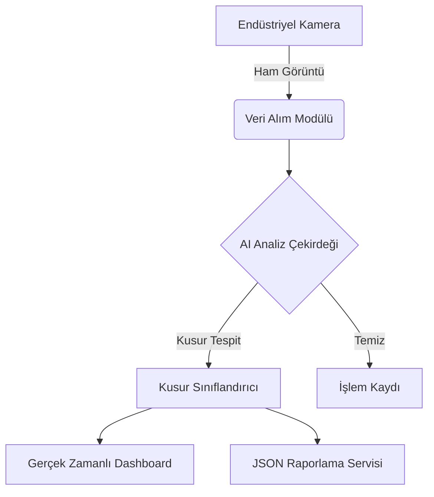

# 🏗️ Sistem Mimarisi: Open Textile Intelligence

Bu belge, **Open Textile Intelligence** projesinin yüksek seviyeli teknik mimarisini ve bileşenlerini açıklar. "Elit Komuta Merkezi" vizyonuyla tasarlanan bu sistem, modülerlik ve ölçeklenebilirlik prensiplerine dayanır.

## 📐 Genel Bakış

Sistem üç ana katmandan oluşur:

1.  **Veri Toplama Katmanı (Sensör Arayüzü)**: Endüstriyel kameralar ve IoT cihazlarından gelen ham veriyi işler.
2.  **Analiz Çekirdeği (Logic Core)**: Yapay zeka algoritmaları ile kusur tespiti ve sınıflandırma yapar.
3.  **Sunum ve Raporlama Katmanı**: Sonuçları operatöre görselleştirir ve veri ambarına aktarır.

## 🧩 Bileşenler

### 1. `FabricScanner` (Analiz Çekirdeği)
- **Konum**: `src/defect_scanner.py`
- **Sorumluluk**: Simülasyonu yönetir, her bir kumaş karesini (`frame`) analiz eder.
- **Algoritma**: Şu anki sürümde olasılıksal bir simülasyon motoru kullanmaktadır. Gelecek sürümlerde CNN (Convolutional Neural Network) tabanlı modeller entegre edilecektir.

### 2. Raporlama Motoru
- Analiz sonuçlarını yapılandırılmış JSON formatında dışa aktarır.
- Tedarik zinciri entegrasyonları için standartlaştırılmış veri şeması kullanır.

## 🚀 Gelecek Planları & Ölçeklenebilirlik

- **Edge Deployment**: Modellerin doğrudan kamera donanımı üzerinde (NVIDIA Jetson vb.) çalıştırılması.
- **Bulut Senkronizasyonu**: Yerel analiz sonuçlarının merkezi bir bulut veritabanına (AWS/Azure) asenkron olarak gönderilmesi.
- **REST API**: Sistemin diğer ERP yazılımları ile konuşabilmesi için Flask tabanlı bir API katmanı.
